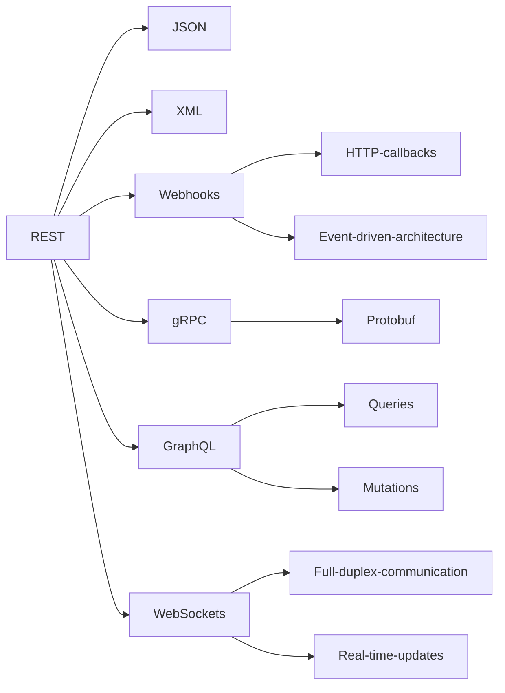

# MeshWeave
Hints at the intricate network of technologies and services.

## API/Services Architectures

## Extra mermaid diagram
circular references

[](https://mermaid.live/edit#pako:eNptksEOgjAQRH-F7Fl-gIMXNV4wUTDx0kulKxCEklIOhvDvtmAoXeypfTOdySY7QCYFQgS54m0RxAlrAnOSU3oPwnAf5Mn1QNDZOm8xoQ98pjKrUHdboZCyMngWbOIkWAdBXvRCafRa8KJ_30n6mrpx1pQWEM3rcF5SQwTXRARvRqL9KZve2yqHvSKHaY1TXCfsoEZV81KYBRislYEusEYGkbkKrioGrBmNj_dapp8mg-jF3x3uoG8F13gsuVmceqEoSi3VZV6pabPGL4act8s)

## ESB-BizTalk-WebServiceComposition
Simple invokation of web services in biztalk server.

For Microsoft Visual Studio Solution File  Visual Studio 2010
BizTalk Deployment Server Version=3.0.1.0

Language used is **C#**

obtains data from endpoint: http://nonnb-w7.dvt.co.za/BizTalkWCF.Orchs/BizTalkWCF_AddSuffixService_RcvSuffixService.svc
invokes method GetDataUsingDataContract result is returned in XML Format

By Andres Leon SOA-Integration Professional
Master Service Oriented Computing

## Web services client
### SOAP
get a WSDL online and then use a CXF utility to generate the java code

wsdl2java is a command-line tool from Apache CXF used to generate Java code from a WSDL document1. Here’s how you can use it:

Download the WSDL file: You need to have the WSDL document saved on your local machine2.

Run the wsdl2java command: The basic syntax of the command is as follows:
```bash
wsdl2java -fe <front-end-name> -db <data-binding-name> -wv <wsdl-version> -p <[wsdl-namespace =]package-name>* -sn <service-name> -d <output-directory> <path-to-wsdl-file>
```

Here’s what some of the options mean:

-fe frontend-name: Specifies the frontend. Default is JAXWS.
-db databinding-name: Specifies the databinding. Default is JAXB.
-wv wsdl-version: Specifies the WSDL version. Default is WSDL1.1.
-p [ wsdl-namespace= ] PackageName: Specifies zero, or more, package names to use for the generated code.
-sn service-name: The WSDL service name to use for the generated code.
-d output-directory: The directory where the generated code will be placed.
Compile and run the generated code: Once you have generated the code, you can compile and run it as you would with any other Java code.
Please note that if your WSDL file is secured (for example, accessed over HTTPS), you might encounter issues with SSL handshake3. In such cases, you might need to manually download and reference any XSD files used in your WSDL2.

Remember to replace <front-end-name>, <data-binding-name>, <wsdl-version>, <[wsdl-namespace =]package-name>*, <service-name>, <output-directory>, and <path-to-wsdl-file> with your actual values.

For more advanced usage and options, please refer to the official Apache CXF documentation. https://cxf.apache.org/docs/wsdl-to-java.html

**2023-10-28**
after some serious struggle trying to get wdl2java to work for a simple WSDL file I found online i have found a solution
- i tried using multiple plugins in gradle kotlin DSL. fail
- i tried switching to maven and using the official CXF. Fail several times
- in maven upgraded to java17 and ajdusted simple settings OK
- I followed docs https://cxf.apache.org/docs/maven-cxf-codegen-plugin-wsdl-to-java.html and https://cxf.apache.org/docs/wsdl-to-java.html
- wsdl is ready